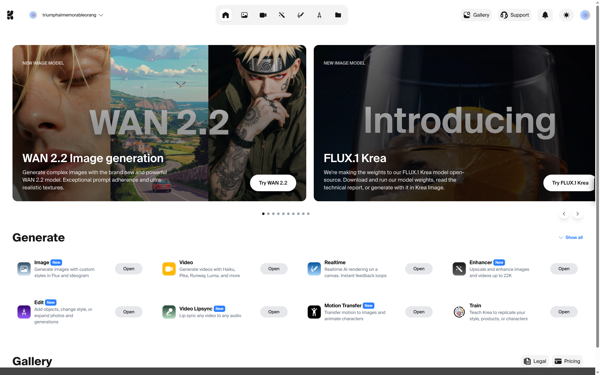
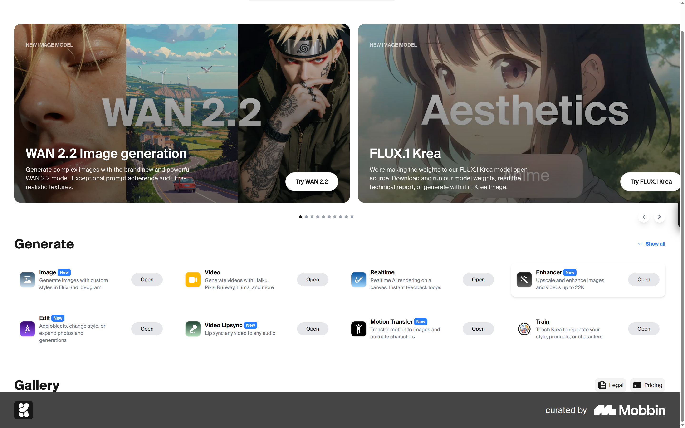
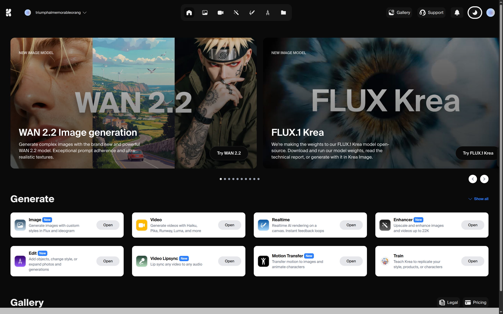
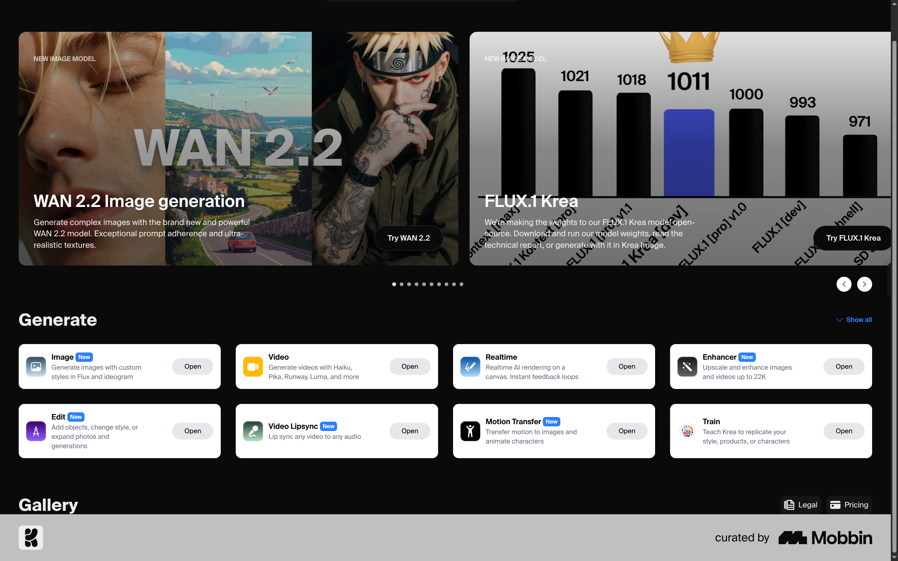

# Cartolinks Solutions LTD - Internship Assignment

Frontend & Mobile Developer Internship Application  
**Applicant:** [Your Full Name]  

---

## 📌 Assignment
Build the given UI design as a **pixel-perfect Next.js + TypeScript app** with the following requirements:
- 🌗 **Dark/Light mode toggle**  
- 🎨 TailwindCSS for styling  
- ⚡ Fully responsive components  
- ✅ Pixel-perfect UI as per provided design  

---

## 🚀 Tech Stack
- [Next.js 15](https://nextjs.org/) – React framework for production-grade apps  
- [TypeScript](https://www.typescriptlang.org/) – Type safety for maintainability  
- [TailwindCSS](https://tailwindcss.com/) – Utility-first styling  
- [Framer Motion](https://www.framer.com/motion/) – Smooth animations 

---

## 📂 Features Implemented (All Responsive)
- **Theme Toggle** – Light/Dark mode with CSS variables + Tailwind integration  
- **Navigation Bar** – Responsive, highlights active links, themed icons  
- **Hero Section** – Scrollable cards with smooth navigation & active indicator dots  
- **Action Cards ("Generate" Section)** – Gradient icons, “New” badges, responsive grid layout  
- **Pixel-perfect styling** – Matches provided design closely across breakpoints  

---

## 🛠️ Getting Started

### 1. Clone the repository
```bash
git clone https://github.com/CodeEnthusiast09/cartolinks.git
cd cartolinks-assignment
```

### 2. Install Dependencies
```bash
npm install
```

### 3. Configure Next.js 
```bash
images: {
  remotePatterns: [
    {
      protocol: "https",
      hostname: "s.krea.ai",
    },
  ],
},
```

### 4. Run the develpment server
```bash
npm run dev
```

## 📸 Screenshots (Light/Dark Mode)

### Light Mode




### Dark Mode




